# Project 1 - OASIS Data Segmentation Using an Improved UNet
The project chosen for this report was project 1, specifically using a 2d adaptation of the 3d Improved UNet described in [1]. The algorithm is an adaptation of the traditional UNet, which we will briefly explain first. In a traditional UNet, inputs are progressively downsampled via convolution, all the way down to a bottleneck, and then upsampled with the outputs of the downsampling blocks concatenated to the input of the upsampling blocks. 
The improved UNet focuses on small batch sizes(2 in our, and in their case), for which they make a few changes. The first is using an Instance Norm instead of a BatchNorm when downsampling, as, per the original paper, stochasticity/noise is much more prevalent in small batch sizes, where this problem is avoided entirely when using an instance norm, which normalises each sample independently. We also switch out the structure of the downsampling blocks entirely, defining a "Context Block" wherein 2 3*3 convolutions are PRECEDED (again in contrast to the traditional UNet) by instance normalisation and leaky ReLU and the addition of the residual. These downsampling blocks are connected by stride 2 convolutions, all the way down to a bottleneck block, and then upsampled with again newly defined localisation blocks. In localisation blocks, we just convolve twice to upsample and then use an instance norm and ReLu non-linearisation again. At each of these upsampling levels, we also elementwise add and upsample a segmentation layer. Finally, the last convolution is applied and classification can be done. In our binary case, this was simple, but in the original case of >2 segments, softmax was used. The figure below shows this architecture courtesy of [1]

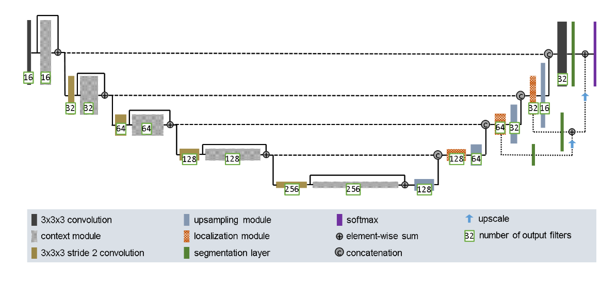

## Files Included

The included files are:
 - ``dataset.py`` - Module containing loaders for OASIS data
 - ``modules.py`` - Module containing blocks and modules used in the Improved UNet architecture
 - ``train.py`` - Script or Module. Includes functions for training and testing Improved UNet, and can be run as a script to do both of those things.
 - ``predict.py`` - Module continaing functions for plotting predictions against ground truth
 - ``driver.py`` Script for putting it all together, training, testing, and plotting predictions. 
 

## Training Information
The data was trained for 20 epochs on a NVidia GTX 4060 with 8GiB of VRAM. It was trained using the Adam Optimizer with DICE criterion, validated at every epoch.
To train the model yourself, on your system of choice, navigate to the directory 
```recognition/project_1_oasis_segmentation_s4744705``` 
and run the command
```train.py```
Training will be done on cuda if available, otherwise on the cpu. 
There are a number of arguments that can be specified but the defaults are those used to train the model as is: 
 - ``--batch-size`` -  The Batch Size used in training
 - ``--epochs`` - The number of epochs to train for
 - ``--lr`` - The learning rate
 - ``--dropout-prob`` - The probability of nodes being dropped out in context blocks
 - ``plot``  - whether or not to save new plots from training
If you want to show the predictions as well, you can run the full pipeline with
```driver.py --train-new 1```
which has the same optional arguments but also takes
 - ``--dir``  - The directory to save plots in
 - ``--seed`` - The seed used to pick which images to predict on
 - ``--train-new`` - Flag indicating whether to train a new model or use that which is saved in the model file. As a model file is not supplied, you would first need to run with ``--train-new 1 ``

## Dependencies
Torch 2.8.0+cu126, TorchVision 0.23.0+cu126, Pillow 11.0.0, MatPlotLib 3.9.2, numpy 1.26.4
## Outputs

When ran, the program produced this command line output
```
Loading data...
Beginning training with device cuda...
Epoch 1 Completed! 
Training Loss: 0.0355254765970028 | Dice Score on Validation Set: 0.8775663760091578...
Epoch 2 Completed! 
Training Loss: 0.01950995646269116 | Dice Score on Validation Set: 0.9337494188121387...
Epoch 3 Completed! 
Training Loss: 0.016672270471193143 | Dice Score on Validation Set: 0.9278236971369811...
Epoch 4 Completed! 
Training Loss: 0.014998315420273124 | Dice Score on Validation Set: 0.9183893856193338...
Epoch 5 Completed! 
Training Loss: 0.013877993091842197 | Dice Score on Validation Set: 0.9213147526340825...
Epoch 6 Completed! 
Training Loss: 0.013089097801916647 | Dice Score on Validation Set: 0.9107733529593264...
Epoch 7 Completed! 
Training Loss: 0.012513440065332596 | Dice Score on Validation Set: 0.9209716972495828...
Epoch 8 Completed! 
Training Loss: 0.012021664900100783 | Dice Score on Validation Set: 0.9164661918367658...
Epoch 9 Completed! 
Training Loss: 0.011645543333513057 | Dice Score on Validation Set: 0.9176608827497278...
Epoch 10 Completed! 
Training Loss: 0.011343211268648406 | Dice Score on Validation Set: 0.9025632022746972...
Epoch 11 Completed! 
Training Loss: 0.011048350655874669 | Dice Score on Validation Set: 0.9158546834119728...
Epoch 12 Completed! 
Training Loss: 0.010829499361432151 | Dice Score on Validation Set: 0.9206432035991123...
Epoch 13 Completed! 
Training Loss: 0.010591357181601178 | Dice Score on Validation Set: 0.9235150057290281...
Epoch 14 Completed! 
Training Loss: 0.010415412288233145 | Dice Score on Validation Set: 0.9276720164077622...
Epoch 15 Completed! 
Training Loss: 0.010237986493288286 | Dice Score on Validation Set: 0.9198930218815804...
Epoch 16 Completed! 
Training Loss: 0.010089273644697588 | Dice Score on Validation Set: 0.926571523398161...
Epoch 17 Completed! 
Training Loss: 0.009961416254079106 | Dice Score on Validation Set: 0.923980648709195...
Epoch 18 Completed! 
Training Loss: 0.00985163561259674 | Dice Score on Validation Set: 0.9325279781860965...
Epoch 19 Completed! 
Training Loss: 0.009715512900656422 | Dice Score on Validation Set: 0.9281788371503353...
Epoch 20 Completed! 
Training Loss: 0.009605896616021528 | Dice Score on Validation Set: 0.923138200278793...
Training complete. Best Dice score: 0.9337494188121387
Beginning testing...
Average Dice Similarity score in testing was 0.9894898218267104
```
Indicating that a testing similarity DICE score of approximately 0.98 was achieved on the test set, and 0.93 on the validation set while training. We can plot the Loss function over training:

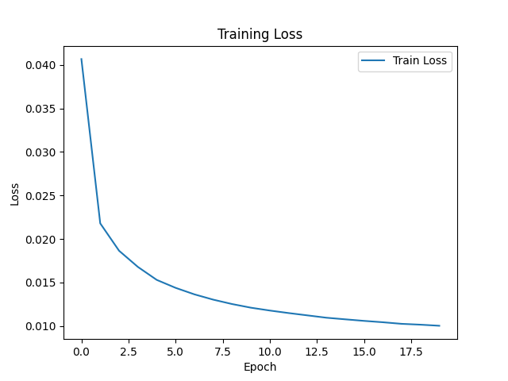

And the DICE score achieved as training was done:

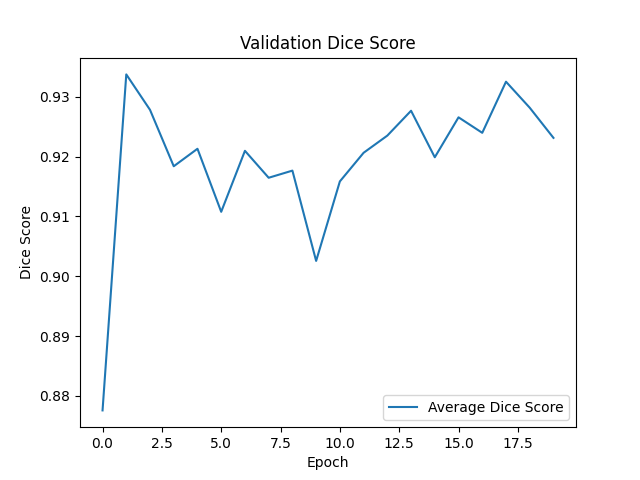

which shows a reasonable training loss curve, and increasing dice similarity score over training. 

We also can inspect some generated mask predictions (seed 1) from each of the validation, training, and test sets. 
### Training Data

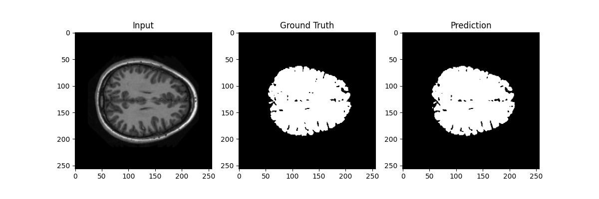
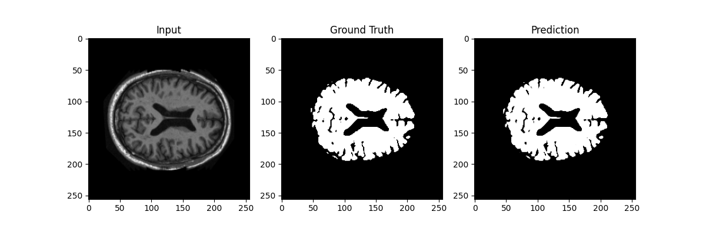
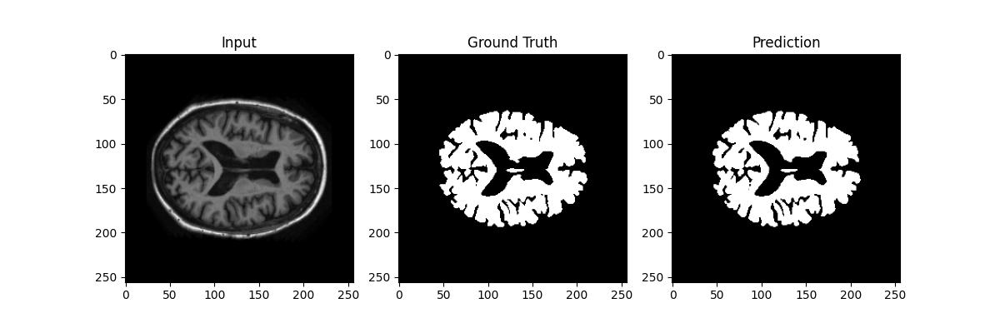
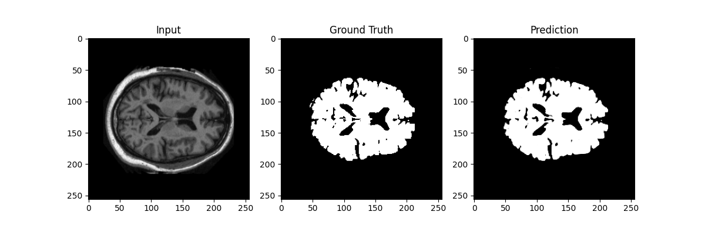

### Validation Data

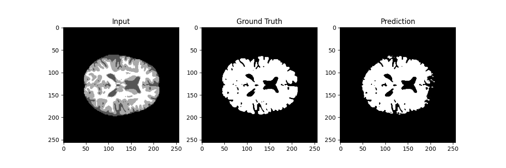
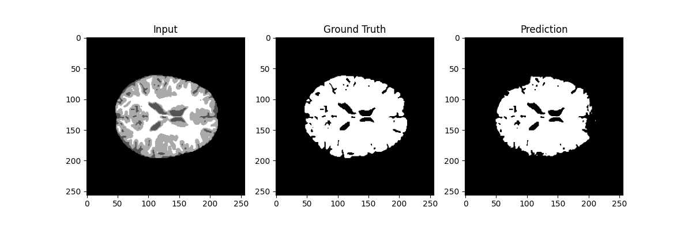
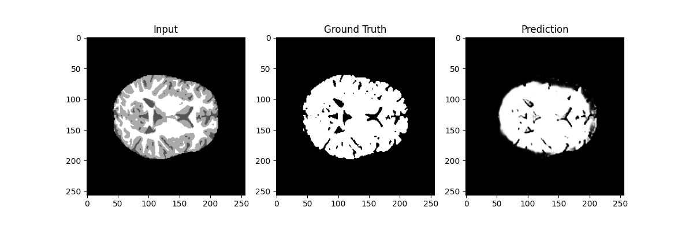
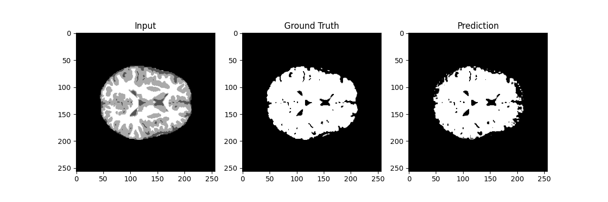

### Test Data


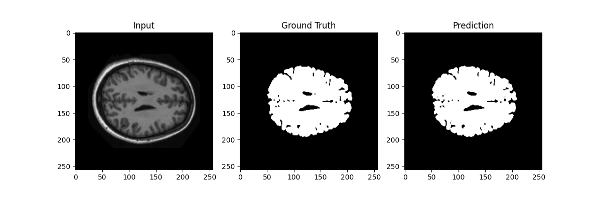
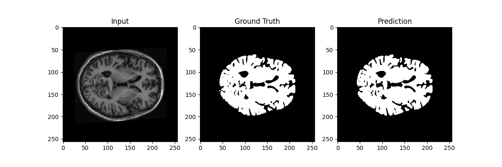
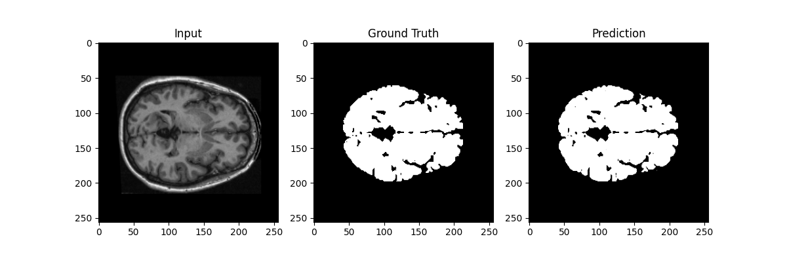
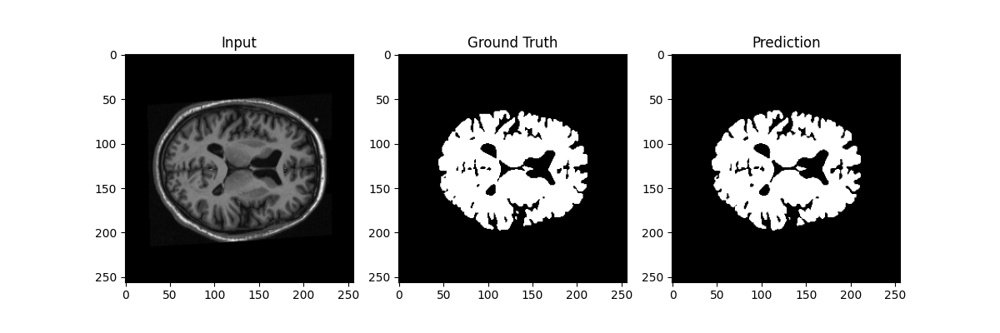

We can observe that in all cases, a visually very accurate mask prediction compared to ground truth was made. 

## Pre-processing
Data preprocesing was as simple as pairing masks and original images, as the train-test-validate split was provided together with the OASIS dataset, with around 5% testing data, 85% training data, and 10% validation data. The only other pre-processing applied is conversion directly to boolean data of masks, and conversion of both original images and masks to tensors with a channel dimension. 

## References
[1] F. Isensee, P. Kickingereder, W. Wick, M. Bendszus, and K. H. Maier-Hein, “Brain Tumor Segmentation
and Radiomics Survival Prediction: Contribution to the BRATS 2017 Challenge,” Feb. 2018. [Online].
Available: https://arxiv.org/abs/1802.10508v1

